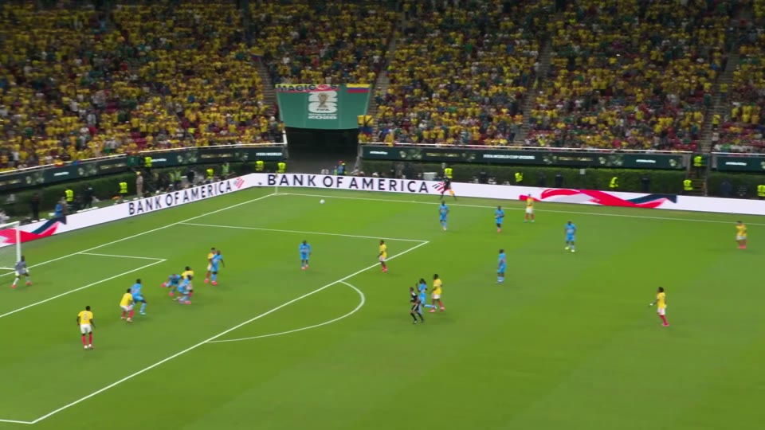
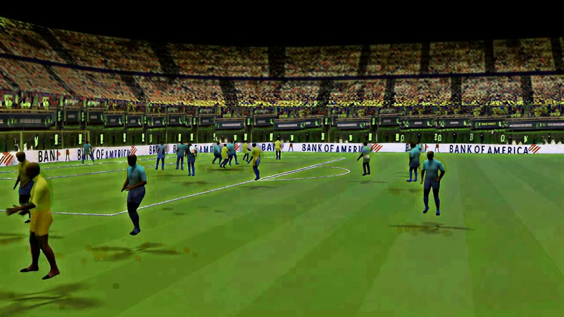
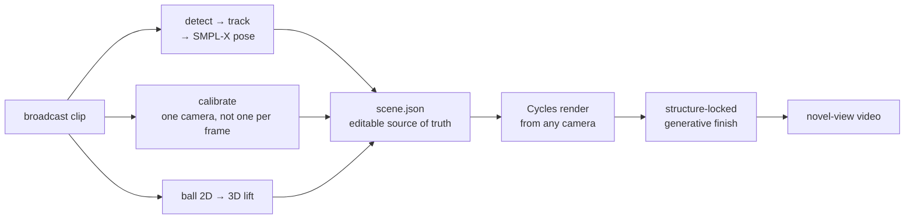
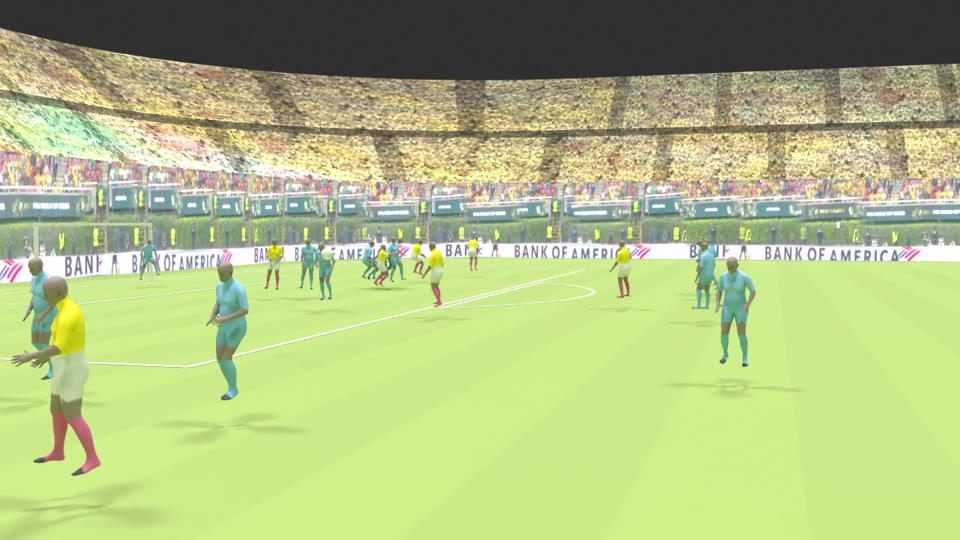
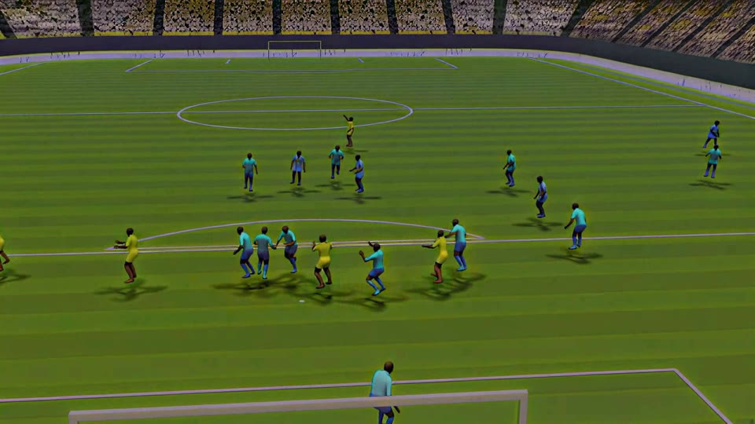

# pitch3d

**One broadcast clip in — a novel-view video of the same episode out.**

Give it a few seconds of ordinary single-camera football broadcast. Get back the same seconds of
play, rendered from a camera that never existed: the same players in the same kits, the same
stadium, the same floodlights. The intermediate 3D scene is a plain JSON file you can edit — by
hand, in Blender, or through an LLM.

<table>
<tr>
<td width="50%"></td>
<td width="50%"></td>
</tr>
<tr>
<td align="center"><b>Input</b> — the source broadcast, frame 40</td>
<td align="center"><b>Output</b> — the same instant, ground-level sideline camera</td>
</tr>
</table>

<sub>Same clip, same frame (Colombia 1–0 Congo DR). The right panel is a real pipeline output —
nothing in it was placed by hand. Photorealism is still being worked on; see
<a href="#status">Status</a> for what is and is not finished.</sub>

---

## Contents

[What it does](#what-it-does) · [Status](#status) · [Quickstart](#quickstart) ·
[How it works](#how-it-works) · [Editing the scene](#editing-the-scene) ·
[Architecture](#architecture) · [Testing](#testing) · [Reproducibility & licences](#reproducibility--licences) ·
[Documentation](#documentation)

## What it does

| | |
|---|---|
| **Input** | One monocular broadcast clip. No multi-camera rig, no depth sensor, no motion capture. |
| **Measures** | Camera calibration, player detection + tracking, per-player SMPL-X body pose, ball trajectory, pitch geometry, kit colours, stadium light. |
| **Produces** | A canonical `scene.json` (the editable source of truth), plus a rendered video from any camera you place. |
| **Runs** | The core is pure Python on CPU. Only the photoreal Blender/diffusion render wants a GPU. |

It is a **reconstruction** tool first and a generative one second. Geometry, camera and motion are
measured from the clip; the generative pass is a structure-locked finishing layer on top of a
render that is already correct — never a substitute for it.

## Status

The bar is set by eye on real footage, not by a metric.

| Stage | State |
|---|---|
| **v0 — correct geometry** | **done.** 20 players at plausible world positions, pitch lines and goals, cameras that frame the action. |
| **v1 — recognizability** | **done.** Kit colours per team, shirt numbers where legible (honest blanks where not), stadium backdrop. |
| **v2 — photorealism** | **in progress.** Measured body texture, grass PBR and light-from-clip are in; the generative finishing pass is still being iterated. |

Look at the output above and judge it yourself — the players read as players and the stadium reads
as the right stadium, but this is not yet broadcast-indistinguishable.

**[`docs/STATUS.md`](docs/STATUS.md) is the live board**: what is open, what was measured, what to
do next. It is kept current; everything else in `docs/` is reference or history.

## Quickstart

Requires Python **3.11+**. Runtime dependencies are `numpy`, `pyyaml` and `scipy` — nothing heavy.

```bash
python3 -m venv .venv && . .venv/bin/activate
pip install -e ".[dev]"
```

**1 — Prove the install works.** An end-to-end run on fake adapters: no GPU, no models, no clip.

```bash
python -m pitch3d --out-dir out/dryrun          # or: just dryrun
```

**2 — Run it on a real clip, CPU only.** Real RF-DETR detection, real ByteTrack tracking, a real
reprojection overlay and a real `scene.json` export. COCO base weights download on first use; the
remaining ports fall back to fakes, which the run prints explicitly.

```bash
pip install -e ".[cv]"
python -m pitch3d.app.cli \
  --clip path/to/clip.mp4 --frames 24 \
  --detector rfdetr --tracker bytetrack \
  --device cpu --render overlay --export gltf --out-dir out/run
```

**Note on pose and calibration.** These two stages are the ones this repo does *not* ship. The
`hmr` extra installs only their substrate (`torch`, `smplx`); the actual networks — SMPLest-X for
body pose, PnLCalib for the pitch solve — are research repos with licences that keep them out of a
public tree, so they are injected at runtime through the ADR-0006 dotted-path seam:

```bash
--pose-backend pkg.module:Factory   --calibrator-backend pkg.module:Factory
```

Without one, `--pose gvhmr` and `--calibrator keypoints` raise a `NotImplementedError` that names
exactly what to wire, rather than silently degrading to a fake. The pure halves (root grounding,
assembly, re-fit, homography solve) are in `core/` and tested.

**3 — Render the photoreal video.** This is the GPU half and it runs on a rented box
([`docs/cloud-dev.md`](docs/cloud-dev.md), [`docs/video-demo.md`](docs/video-demo.md)):

```bash
ANIM_CAMERAS=sideline OUT=out/anim_finish bash scripts/pod_finish_batch.sh
```

**Useful flags** (`python -m pitch3d.app.cli --help` for the full list):

| Flag | Meaning |
|---|---|
| `--clip PATH` | Real clip to ingest. Omit for a synthetic one. |
| `--frames N` `--out-dir DIR` | How much to process, and where artifacts land. |
| `--detector` `--tracker` `--calibrator` `--pose` `--ball` `--render` `--export` | Swap any port between its fake and a real adapter. |
| `--device cpu\|cuda` | CPU validation vs GPU production (ADR-0009). |
| `--camera-carry N` | Propagate the camera solve across N frames. `0` = solve every frame. |
| `--no-stitch` | Turn off tracklet re-linking before pose (on by default). |
| `--coherence` `--physics` | Bridge short pose gaps; run the physics correction chain. |
| `--pose-backend pkg.module:Factory` | Inject a heavy backend by dotted path without touching the core (ADR-0006). |

`just` wraps the common ones: `setup`, `setup-local`, `cloud-setup`, `test`, `dryrun`, `lint`,
`clean`.

## How it works

Two halves. **Reconstruction** measures the clip into a 3D scene and renders it from a new camera.
**Finishing** makes that render photoreal without being allowed to move anything.



<table>
<tr>
<td width="50%"></td>
<td width="50%"></td>
</tr>
<tr>
<td align="center"><b>The measured half</b> — Blender Cycles, straight from <code>scene.json</code>. Everything downstream is locked to this geometry.</td>
<td align="center"><b>Any camera</b> — the same instant from behind the goal. Placing a new one costs a re-render, not a re-solve.</td>
</tr>
</table>

The split matters: if the generative pass is allowed to invent geometry it will, and the result
stops being a reconstruction of *this* episode. So every finishing step either makes identity
unambiguous in the control signal, or undoes drift the diffusion pass introduced.

Full stage-by-stage diagrams, the reason each step survives, and its kill switch:
[`docs/pipeline.md`](docs/pipeline.md).

## Editing the scene

`scene.json` is the source of truth, and **corrections are the only way to change it** (ADR-0002) —
edits are recorded as typed operations and replayed, not baked into the geometry. That gives one
edit path with three front ends:

- **Blender**, live: drag a player's root Empty and it becomes a `ROOT_TRANSLATION` correction on
  the host. Blender reports world positions; it never owns the scene (ADR-0010).
- **An LLM**, over MCP: exactly the same use cases the human drives, with rendered frames as visual
  feedback (ADR-0008). `pitch3d-mcp` is the server.
- **The Studio web UI** for annotation and re-running the correction chain on a loaded scene:

  ```bash
  .venv/bin/uvicorn poseannot.app:app --host 0.0.0.0 --port 8000
  ```

## Architecture

Hexagonal (ADR-0001). Dependencies point **inward**: `app → adapters → core`. The core never
imports an adapter, `bpy`, or any ML library.

```
src/pitch3d/
  core/       # pure Python: scene model, correction maths, physics gates, port contracts
  adapters/   # everything infrastructural: models, render, blender, export, mcp, fakes
  app/        # composition root, CLI, exporters
poseannot/    # Studio: FastAPI annotation + re-run UI
scripts/      # pod pipeline, benchmarks, one-off probes
tests/        # green without GPU, Blender or model weights
```

| Principle | Where |
|---|---|
| Pure core behind ports | `core/ports`, `core/scene`, `core/correction` |
| Heavy models lazy-loaded by dotted path, gated behind extras (ADR-0006) | `adapters/models`, `--*-backend` flags |
| Corrections are the sole edit path (ADR-0002) | `core/correction` |
| Human ≡ LLM as editors, over MCP (ADR-0008/0010) | `adapters/mcp` |
| Every measured estimator ships a manual override | auto (`.npz`) → CLI flag/env → default |

Which file owns which subsystem: [`docs/code-map.md`](docs/code-map.md).

## Testing

```bash
.venv/bin/python -m pytest        # 1125 passed / 14 skipped in ~70 s, no GPU or weights needed
```

Be clear about what that proves. `tests/conftest.py` is **fakes-backed by design** — no GPU, no
Blender, no weights — so a green suite is a fast smoke signal, not evidence that the pipeline works
on real footage. Substantial parts of the user-facing path have no direct coverage; the honest
accounting lives in [`docs/STATUS.md`](docs/STATUS.md).

The one exception is [`tests/e2e/test_golden_real_camera.py`](tests/e2e/test_golden_real_camera.py),
backed by a real measurement instead of a fake: a 7 kB camera fit solved off the target broadcast
clip, small enough to commit so it runs in CI too. It pins what the *code derives* from it — the
recovered focal length, that all frames share one optical centre, where the camera sits, and the
framing the human operator actually shot. It is mutation-checked, and its docstring lists both the
regressions it catches and the one it does not.

Real evidence otherwise comes from the rendered output and the probe scripts in `scripts/`
(`bench_*.py`, `mutate_*.py`), which [`docs/adr/0012-rejected-approaches-log.md`](docs/adr/0012-rejected-approaches-log.md)
cites with numbers — re-run them rather than trusting the write-up.

**Lint** is baseline-gated: a changed file may not *gain* violations. `pre-commit` and CI both call
the same script, so they cannot disagree.

```bash
pre-commit install                        # once per clone
.venv/bin/python scripts/lint_changed.py  # the exact verdict the hook and CI will give
```

## Reproducibility & licences

- [`pyproject.toml`](pyproject.toml) is the dependency source of truth. Exact transitive pins live
  in [`requirements.txt`](requirements.txt) / [`requirements-dev.txt`](requirements-dev.txt),
  regenerated with `pip-compile [--extra dev] --strip-extras pyproject.toml`.
- Heavy extras (`cv`, `hmr`, `ball`, `env`, `avatars`, `viewsynth`, `blender`) are declared and
  exact-pinned with inline licence notes, but **not installed** by default — adapters lazy-import
  them, so the core and tests run without any of them. They lock per-milestone because they cannot
  resolve without CUDA or a Blender install.
- This is **internal / research** use, so GPL (Blender), AGPL (some detectors) and the SMPL-X model
  licence apply. SMPL-X model files are non-commercial and are **not** redistributed here.

## Documentation

Two files are the whole cold start:

| Read | For |
|---|---|
| [`CLAUDE.md`](CLAUDE.md) | How to work in this repo — commands, rules, gotchas that cost a session. |
| [`docs/STATUS.md`](docs/STATUS.md) | What is true right now: open items, measured health, what to do next. |

Then, on demand:

| Read | For |
|---|---|
| [`docs/pipeline.md`](docs/pipeline.md) | The clip → final chain, stage by stage, with diagrams. |
| [`docs/architecture.md`](docs/architecture.md) | Layering, port contracts, data and control flow. |
| [`docs/scene-schema.md`](docs/scene-schema.md) | Field-by-field spec of `scene.json`. |
| [`docs/code-map.md`](docs/code-map.md) | Which file owns which subsystem. |
| [`docs/adr/`](docs/adr/) | The decisions and why (0001–0012). |
| [`docs/adr/0012-rejected-approaches-log.md`](docs/adr/0012-rejected-approaches-log.md) | What was tried and rejected, with the numbers. |
| [`docs/findings/`](docs/findings/) | Root-cause write-ups for open items. |
| [`docs/cloud-dev.md`](docs/cloud-dev.md) · [`docs/runpod-runbook.md`](docs/runpod-runbook.md) | Provisioning a GPU box, and cost control. |
| [`TZ_3D_football_reconstruction.md`](TZ_3D_football_reconstruction.md) | The requirements spec this is built against (v0.3). |

[`docs/roadmap.md`](docs/roadmap.md) and [`docs/m1-status-and-plan.md`](docs/m1-status-and-plan.md)
are **historical build logs about platform plumbing** — useful for archaeology, misleading as
current state. Use `docs/STATUS.md` instead.
