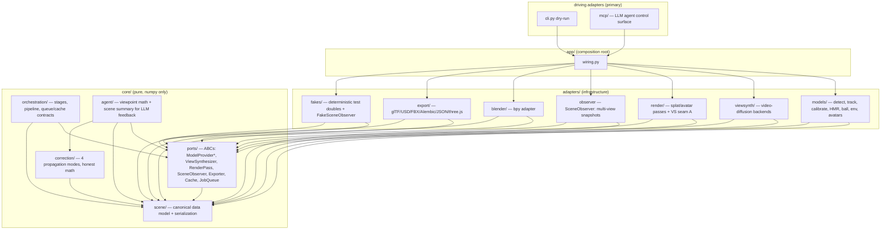
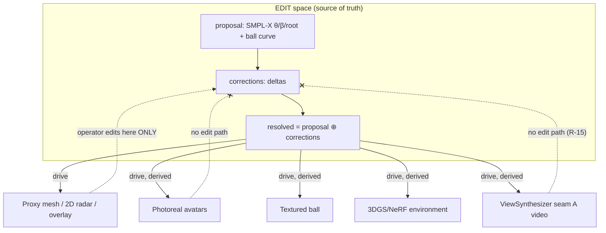
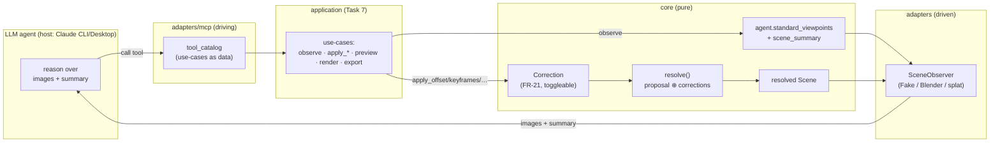

# pitch3d — Architecture

> Requirements source of truth: [`TZ_3D_football_reconstruction.md`](../TZ_3D_football_reconstruction.md) (v0.3).
> This document fixes the *shape* of the solution: layering, the canonical scene model,
> the port contracts, the data/control flows, and where the two **ViewSynthesizer** seams sit.
> Decisions are recorded as ADRs in [`adr/`](adr/); risks in [`risk-map.md`](risk-map.md); plan in [`roadmap.md`](roadmap.md).

---

## 1. What we are building (one paragraph)

An **offline desktop** Python tool that reconstructs an **editable, photorealistic 3D**
football episode from **one broadcast camera** (≤30 s, ≤24 people). The operator gets a
3D scene with raw model output as a non-destructive *proposal*, fixes the few wrong
poses/trajectories, **propagates** those fixes across frames, and renders/exports a
photoreal result. Real-time is not a goal; **quality and ease of manual correction are**.

---

## 2. Constraints that shape the architecture

| # | Constraint | Architectural consequence |
|---|---|---|
| C1 | Pure **hexagonal** core | `core/` imports neither `bpy` nor any ML/render/video-diffusion library — only `numpy`. Everything infrastructural is an adapter behind a port (ADR-0001, ADR-0002). |
| C2 | **Dual representation** | Edit = SMPL-X (θ, β, root) + curves on a proxy. Render = 3DGS/NeRF + avatars + ball, **or** ViewSynthesizer video. **Single source of truth = SMPL/curves**; render is derived and never edited (ADR-0002). |
| C3 | **Mono** MVP | One source, one viewpoint. Real multi-camera is only a *seam* (a camera list; homography is a degenerate calibration) — **not built** (ADR-0005 data model leaves room). |
| C4 | **Models are swappable** | One `ModelProvider` family of ports; self-hosted and external-API adapters are interchangeable (NFR-6). |
| C5 | **Offline queue + content-addressable cache** | Every stage is a job; results are keyed by `hash(input + params + model_version)`. Expensive generative passes (avatars, ViewSynthesizer) are always cached (ADR-0004). |
| C6 | **ViewSynthesizer at two seams** | Seam A = a `RenderPass` (limited orbit, video out, non-editable). Seam B = pre-reconstruction amplifier (mono → pseudo-multi-view) + occlusion inpaint (ADR-0007). |
| C7 | Photoreal **staged** | M1 editable proxy loop → M2 photoreal (+ VS seam A) → M3 quality (+ VS seam B). (roadmap). |
| C8 | **LLM-in-the-loop** automation | The editor is drivable by an LLM over **MCP** (a driving adapter, parallel to the CLI), with **visual feedback**: a `SceneObserver` port renders the resolved scene from several viewpoints + frame overlays + UI screenshots. Agent edits are `Correction`s, never raw geometry (ADR-0008). |

---

## 3. Layering (dependencies point inward)



**Rule:** arrows only point toward `core`. `core/` has no arrow leaving it (except `numpy`).
The only way the core touches Blender, a GPU model, a video-diffusion API, or an LLM is through
a port/adapter. Both the CLI and the **MCP server** are *driving* adapters that call the same
application wiring — so an LLM agent and a human run the identical use-cases. This is what makes
the whole core testable with **fakes, no GPU, no Blender, no LLM** (AC-7).

---

## 4. Package structure & responsibilities

```
src/pitch3d/
  core/
    scene/          # WorldFrame (Z-up, meters), Field+homography, Camera, Subject (SMPL-X),
                    # BallTrack, 3-layer model (proposal/corrections/resolved), Confidence,
                    # RenderAssetRef, SynthViewRef, provenance/RunLog, JSON serialization
    correction/     # rotations (Rodrigues/slerp/Shepperd), 4 propagation modes as pure functions,
                    # layer resolve (proposal ⊕ corrections → resolved)
    orchestration/  # Stage enum, Pipeline DAG, cache-key derivation, ball 2D→3D lift,
                    # contracts used from ports (JobQueue/Cache) — abstract only
    agent/          # pure viewpoint camera math (look_at, standard_viewpoints) + scene_summary
                    # — the port-free pieces of the LLM visual-feedback loop (ADR-0008)
    ports/          # ABCs only: ModelProvider, Detector, Tracker, FieldCalibrator,
                    # PoseEstimator(+refit), BallTracker, EnvReconstructor, AvatarBuilder,
                    # ViewSynthesizer (seams A&B), RenderPass, SceneObserver, Exporter, Cache, JobQueue
  adapters/
    models/         # real-model adapters behind ports: detect/track/calibrate/pose/ball all wired
                    # (split: pure half unit-tested via injected stub; heavy half gated by extra)
    viewsynth/      # ViewSynthesizer backends (ReCamMaster/TrajectoryCrafter/GEN3C…) — stubs, both seams
    blender/        # proxy plan (pure, no bpy) + out-of-process `blender --background` (.blend F-curves, proxy SCENE_3D) — gated on a binary
    render/         # ReprojectionOverlayRenderPass wired (numpy+stdlib, no GPU); splat/VS-seam-A stubs
    mcp/            # LLM control surface: tool→use-case dispatch (pure) + serve() over stdio (lazy SDK, mcp extra) — driving adapter, ADR-0008
    export/         # GltfExporter wired: SMPL-X npz + JSON real; glTF/GLB gated (export extra); USD/FBX/Alembic stubs
    fakes/          # deterministic doubles incl. FakeViewSynthesizer (both seams),
                    # FakeSceneObserver (stdlib PNG snapshots), in-proc queue, cache
  app/              # wiring (composition) + CLI dry-run (source → … → export)
```

---

## 5. Canonical scene model (summary)

Full field-by-field spec: [`scene-schema.md`](scene-schema.md). At a glance:

- **WorldFrame** — Z-up, right-handed, **meters**; field plane = XY at Z=0 (matches Blender;
  exporters convert to Y-up for glTF/USD). Gravity along −Z.
- **Source → Episode → Scene → Project.** *Episode* is a time-range selection on a *Source*;
  *Scene* is the reconstruction of one episode; *Project* holds them all + settings.
- **Subject** — `track_id`, role, team, jersey; carries a **proposal** `SubjectMotion`
  (`SmplxShape` β shared + `PoseSequence` θ/global_orient/transl per frame).
- **BallTrack** — `positions_3d` per frame + **explicit `height_confidence`** (mono height is
  uncertain, R-4) + ground-contact flags.
- **Three layers, non-destructive.** `proposal` (raw model) → `corrections` (operator deltas as
  `Correction` records) → `resolved` (computed by the correction engine, never hand-stored).
  Single source of truth stays SMPL/curves.
- **Confidence** — per-frame/per-joint confidence + reprojection error → drives the
  "needs attention" list (UX-4) and the confidence map (FR-17).
- **RenderAssetRef** — pointer to a derived render asset (env splats, avatar, ball texture) with
  `ModelInfo` (name/version/license/cost) for provenance (NFR-7).
- **SynthViewRef** — a ViewSynthesizer output: its **seam** (A render / B amplify / B inpaint),
  the synthesized **camera trajectory**, the video/frames URI, frustum-overlap confidence, and a
  hard flag that seam-A output is **video, not editable** (R-15, UX-7).

Serialization: native is **custom JSON** (+ `.npz` sidecar for large arrays in production),
structured to be **USD-mappable**; USD/glTF/FBX/Alembic are *export targets*, not the store
(ADR-0005). The JSON codec round-trips dataclasses, enums and numpy arrays.

---

## 6. Ports (the whole contract surface)

| Port | Purpose | Notable methods |
|---|---|---|
| `ModelProvider` (base) | Provenance + capability advertisement | `info() -> ModelInfo` |
| `Detector` | Players/keepers/refs/ball per frame (FR-5) | `detect(clip: ClipRef) -> Detections` |
| `Tracker` | Stable IDs + team classification (FR-6) | `track(clip, detections) -> Tracks` |
| `FieldCalibrator` | Field homography per frame (FR-7) | `calibrate(clip) -> FieldCalibration` |
| `PoseEstimator` (HMR) | SMPL-X θ/β per subject (FR-8) **and** constraint-guided **re-fit** | `estimate(clip, tracks, calibration) -> dict[int, SubjectMotion]`, `refit(clip, motion, constraints, frames) -> SubjectMotion` |
| `BallTracker` | 2D ball track (FR-9); 3D lift is core math | `track_ball(clip) -> Ball2DTrack` |
| `EnvReconstructor` | 3DGS/NeRF environment (FR-11) | `reconstruct(clip, camera, synth_views=None) -> RenderAssetRef` |
| `AvatarBuilder` | Photoreal avatar per subject (FR-12) | `build(subject, ref_crops, synth_views=None) -> RenderAssetRef` |
| **`ViewSynthesizer`** | Generative novel-view, **two seams** | **A:** `render_orbit(clip, target_camera, scene_hints=None) -> SynthViewRef`; **B:** `amplify(clip, n_views, deviation) -> list[SynthViewRef]`, `inpaint_occlusions(subject_views) -> SynthViewRef` |
| `RenderPass` | Photoreal frame(s) from current scene state (FR-14) | `render(scene, camera_path, quality=PREVIEW) -> RenderResult` |
| **`SceneObserver`** | Visual feedback for the LLM loop (ADR-0008): 3D-from-N-viewpoints + frame overlay + top-down radar + UI | `capture_scene_views(scene, views, quality=PREVIEW)`, `capture_frame_overlay(scene, frame)`, `capture_radar(scene, frame=0)`, `capture_ui(scene=None)`, `observe(..., include_radar=False) -> Observation` |
| `Exporter` | glTF/USD/FBX/Alembic/JSON/three.js (FR-26..28) | `supports(fmt) -> bool`, `export(scene, fmt, out_path) -> ExportResult` |
| `Cache` | Content-addressable artifact store (NFR-4) | `key_for(stage, input_hash, params, model_version)`, `has/get/put` |
| `JobQueue` / `Worker` | Offline non-blocking execution (UX-8) | `submit(stage, thunk, meta=None) -> JobHandle`, `state(job)`, `result(job)`, `cancel(job)`; `Worker.run(thunk)` |

`ViewSynthesizer` deliberately exposes **both seams** on one port: seam A returns a
`SynthViewRef` whose video an adapter can wrap as a `RenderPass`; seam B returns
`SynthViewRef`s consumed by `EnvReconstructor`/`AvatarBuilder` as pseudo-multi-view input.

---

## 7. End-to-end data & control flow

```mermaid
flowchart LR
    SRC[Source video / frames] --> EP[Episode select<br/>manual or action-spotting]
    EP -->|optional| AMP{{ViewSynthesizer<br/>SEAM B: amplify}}
    AMP -. synth views .-> RECON
    EP --> RECON

    subgraph RECON["Reconstruction stages (offline jobs, cached)"]
        direction TB
        DET[Detect] --> TRK[Track + teams] --> CAL[Field homography]
        CAL --> HMR[HMR → SMPL-X<br/>root from homography]
        TRK --> HMR
        HMR --> BALL[Ball 2D track → 3D lift ballistic]
        BALL --> ASM[Assemble Scene<br/>proposal layer + confidence]
    end

    ASM --> EDIT
    subgraph EDIT["Edit loop (proxy, SMPL/curves)"]
        direction TB
        OVL[Reprojection overlay + confidence map] --> FIX[Fix pose/ball/placement]
        FIX --> PROP[Propagate: offset / interp / re-fit / smooth]
        PROP --> RES[Resolve layers → resolved]
        RES --> OVL
    end

    RES --> RENDER{Render path}
    RENDER -->|3DGS / avatars<br/>free camera| RP1[SplatAvatarRenderPass]
    RENDER -->|limited orbit| RP2{{ViewSynthesizer SEAM A<br/>video, not editable}}
    RP1 --> EXP[Export glTF/USD/FBX/Alembic/JSON + three.js]
    RP2 --> EXP

    ENV[EnvReconstructor] -. uses .-> AMP
    AV[AvatarBuilder] -. uses .-> AMP
    ENV --> RP1
    AV --> RP1
```



Key reading of the diagram:
- **Seam B** (amplify) sits *before* reconstruction, feeding synthetic views into
  `EnvReconstructor`/`AvatarBuilder` (mono → pseudo-multi-view).
- **Seam A** (orbit) is *one of two render paths*, parallel to the splat/avatar path. It is a
  shortcut to photoreal for **moderate** camera moves only; it produces **video, not geometry**.
- The **edit loop only ever touches SMPL/curves** (the proposal/resolved layers). It never edits
  render output.

### 7.1 Edit → render synchronization (single source of truth)



Any edit lands in `corrections`; `resolve()` recomputes `resolved`; **every** render
representation is re-driven from `resolved`. There is no back-channel from pixels to geometry.

---

## 8. Correction engine — four propagation modes (FR-22)

Pure functions over SMPL/curves in `core/correction/` (honest math, fully unit-tested,
no GPU/Blender):

1. **`constant_offset`** — add a fixed delta over a range. Translations/ball: vector add.
   Rotations: **compose** in rotation space (`R_offset · R_proposal`), not naive addition.
2. **`interp_between_keys`** — operator sets keyframes; fill the range. Linear for vectors,
   **slerp** for rotations.
3. **`refit`** — constraint-guided HMR on selected frames via the injected `PoseEstimator.refit`
   port (the only mode that calls a model; core stays pure by depending on the abstraction).
4. **`temporal_smoothing`** — windowed smoothing; variance-reducing on vectors, quaternion-aware
   on rotations.

All four return **new** `Correction` records (non-destructive, FR-21); `resolve()` folds them
over the proposal; preview = resolve-without-commit (FR-23); batch = apply to many
subjects/ranges (FR-24).

---

## 9. Execution: job queue + content-addressable cache (ADR-0004)

- Each stage (`AMPLIFY?`, `DETECT`, `TRACK`, `CALIBRATE`, `POSE`, `BALL`, `ENV`, `AVATAR`,
  `RENDER`, `EXPORT`) is submitted as a **job** to a `JobQueue`; the UI stays responsive (UX-8).
- A job's output is stored under `key = hash(stage, input_hash, params, model_version)`. Re-runs
  with unchanged inputs are cache hits — **generative passes (avatars, ViewSynthesizer) are never
  recomputed** when inputs are unchanged (NFR-4). The fake queue runs in-process; a real worker
  (subprocess/Celery-class) is an adapter swap.

---

## 10. Risk → architecture hooks (full table in [`risk-map.md`](risk-map.md))

| Risk | Hook in this architecture |
|---|---|
| edit↔render desync (R-3) | one source of truth (§7.1); render always re-driven from `resolved` |
| per-subject avatar cost ×24 (R-2) | avatars are `RenderAssetRef`s built on demand + cached; default strategy = textured SMPL-X |
| mono ball height (R-4) | `BallTrack.height_confidence` is explicit; 3D lift is core ballistics |
| homography drift (R-6) | `FieldCalibration` carries per-frame confidence + temporal smoothing slot |
| non-blocking UI (R-10) | everything heavy is a queued job |
| VS frustum limit (R-14) | seam A only on moderate moves; free camera ⇒ splat/avatar path |
| VS pixels-not-geometry (R-15) | seam-A `SynthViewRef` flagged non-editable; no edit path |
| VS crowds/identity drift (R-16) | preview + overlay gating, selective application, bounded deviation |

---

## 11. LLM-in-the-loop automation (MCP + observation) — ADR-0008

**Goal:** an LLM agent drives the *same* editor a human does — open an episode, find the wrong
poses/trajectories, fix them, and **check the result by looking at it**. This adds two seams and
zero new coupling in `core`.

**Two new seams**

- **MCP server = a *driving* adapter** (`adapters/mcp/`), parallel to the CLI. Its tool catalog
  (`tools.py::tool_catalog`) is the application's use-cases as pure data — `list_episodes`,
  `run_reconstruction`, `observe`, `get_attention`, `apply_offset|keyframes|smoothing|refit`,
  `set_correction_enabled`, `preview`, `render`, `export`. The catalog is **import-free** (no SDK),
  so the agreed surface is testable today; the live `serve()` is gated behind the optional `mcp`
  extra + the app controller (Task 7) and is an honest `NotImplementedError` until then.
- **`SceneObserver` = a *driven* port** (`core/ports/observation.py`). One `observe()` returns an
  `Observation` = images + a textual `summary`, where images come in four kinds:
  `SCENE_3D` (resolved scene from N canonical viewpoints), `FRAME_OVERLAY` (source frame +
  reprojection), `RADAR` (camera-free top-down tactical minimap, opt-in via
  `observe(include_radar=True)`), `UI` (editor screenshot). It composes the existing `RenderPass`;
  producing real pixels is an adapter, so `core` ships the contract + a stdlib `FakeSceneObserver`.
  `capture_radar`/`capture_ui` are *concrete and default to `None`* — an observer opts in by
  overriding (the fake renders a real minimap; the Blender observer delegates to it, since the
  radar is pure 2D and needs no Blender).

**Viewpoint math is pure core** (`core/agent/`): `look_at` (OpenCV +Z-forward, world→camera),
`standard_viewpoints` (front/left/top/broadcast + an orbit ring around the action centroid), and
`scene_summary`, which turns the UX-4 attention list into the text half of the feedback. No
adapter, no I/O — just numpy, so the agent's "where do I look" decision is unit-tested.

**The loop** — `observe → reason(images + summary) → mutate via a correction tool → resolve →
observe`:



**Guardrails (why this is safe).** Every agent edit is a `Correction`, the same reviewable unit a
human produces: toggleable, previewable (FR-23), reversible. The agent **never** writes resolved
geometry and **never** edits render output — `resolve()` stays the only path from
proposal+corrections to pixels. Feedback is honest because snapshots come from the same
`RenderPass` a human sees, from canonical viewpoints, with the attention list as guidance.
Cost (N renders per `observe`) is bounded by `PREVIEW` quality, the content-addressable cache
(§9), and letting the agent request only the viewpoints it needs. The whole loop runs in tests and
the dry-run on `FakeSceneObserver` — **no GPU, no Blender, no LLM** required to exercise it.

---

## 12. Milestones (detail in [`roadmap.md`](roadmap.md))

- **M0** — skeleton: project/source/timeline, canonical scene model, queue+cache, hex core, glTF export.
- **M1** — editable loop: detect+track+homography+HMR, placement, ball-on-ground, proxy, reprojection overlay, pose/trajectory editing, propagation. *Artifact: an editable 3D clip.*
- **M2** — photoreal: 3DGS/NeRF env, avatars (#1+#2), render pass, edit↔render sync. **+ ViewSynthesizer seam A** (optional orbit render).
- **M3** — quality: per-subject Gaussian avatars (#3) selectively, constraint-guided re-fit, **ViewSynthesizer seam B** (amplify + inpaint), confidence/prioritization, versioning, web export.
