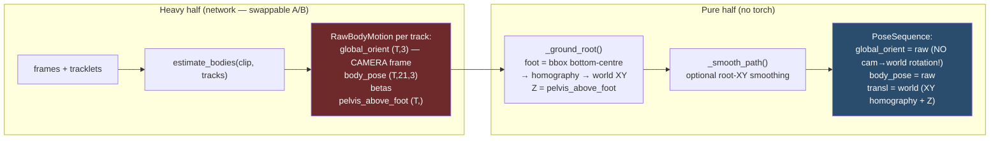
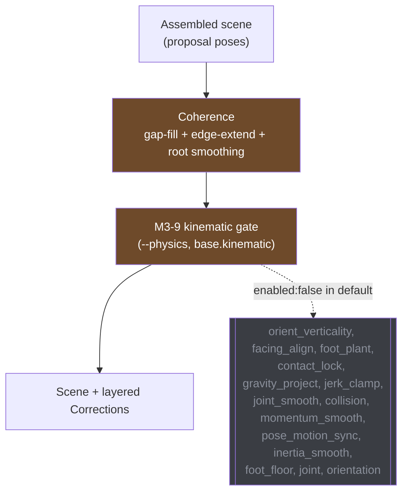
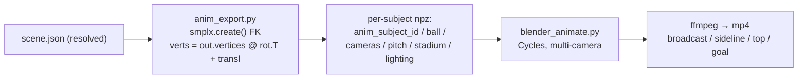

# pitch3d pipeline — from broadcast video to 3D animation (detailed)

> End-to-end walkthrough of the reconstruction: **one broadcast camera → world-space SMPL-X
> humans → multi-angle rendered video**. Expanded, concrete, English counterpart of
> `docs/pipeline-ru.md`, with extra depth on **player physics, pose estimation, and filtering**.
>
> Every fact is verified against the code as of 2026-07-09. Citations are `file:line` for
> navigation. Numbers in §17 ("What actually ran") are measured from the local A/B outputs
> (`out/anim_A`, `out/anim_B`). **Read §18 (Honest caveats) — it states what is NOT yet done
> and what was switched OFF in the A/B run you are reviewing.**

---

## 0. The whole pipeline at a glance

```mermaid
flowchart TD
    V["Source video<br/>Colombia 1080p mp4"] --> DEC["1. Decode frames<br/>ffmpeg / ffprobe → ClipRef"]
    DEC --> DET["2. Detect<br/>RF-DETR<br/>ball/GK/player/ref"]
    DET --> TRK["3. Track<br/>ByteTrack + k-means teams"]
    TRK --> STI["4. Stitch tracklets<br/>union-find, gap≤12"]
    STI --> IDN["5. Identity gate<br/>(off by default)"]
    IDN --> CAL["6. Field calibration<br/>PnLCalib HRNet → homography"]
    CAL --> POSE["7. POSE ESTIMATION<br/>A: SMPLest-X / B: SAM 3D Body → SMPL-X"]
    POSE --> B2D["8. Ball 2D<br/>TrackNet / WASB"]
    B2D --> BLIFT["9. Ball lift to 3D<br/>homography + gravity parabola"]
    BLIFT --> COH["10. Coherence<br/>gap-fill SLERP + edge-extend + smoothing"]
    COH --> PHY["11. Physics / filtering<br/>M3-9 kinematic gate (+ opt-in gate chain)"]
    PHY --> ASM["12. Assemble Scene<br/>Scene + layered Corrections"]
    ASM --> RES["13. Resolve + Export<br/>proposal ⊕ corrections → scene.json/glTF"]
    RES --> ANIM["14. anim_export<br/>SMPL-X FK → per-subject mesh npz"]
    ANIM --> BL["15. Blender Cycles<br/>multi-camera, floodlit-night"]
    BL --> FF["16. ffmpeg<br/>libx264 mp4 per camera"]

    style POSE fill:#2a4d6e,color:#fff
    style PHY fill:#6e4a2a,color:#fff
    style COH fill:#6e4a2a,color:#fff
    style RES fill:#3a5a3a,color:#fff
```



**Actual execution order** (`core/orchestration/pipeline.py:73-141` `ReconstructionPipeline.run`):
`DETECT → TRACK → [stitch] → [identity] → CALIBRATE → POSE → BALL → lift_ball_to_3d`.
Coherence + physics run *after* assembly, inside `app/controller.py:203-292` `run_reconstruction`.

**Architecture — hexagonal (ports/adapters, ADR-0001).** The pipeline imports *no* adapter; it
runs over injected ports (`Detector`, `Tracker`, `FieldCalibrator`, `PoseEstimator`, `BallTracker`).
Two consequences that matter here:

- **A/B pose swap is one flag.** `--pose-backend` selects `smplestx_backend:make` (A) or
  `sam3dbody_backend:make` (B); nothing else in the DAG changes. Entry: `__main__.py:8` →
  `app/cli.py:479-656` (argparse) → `app/wiring.py:80-200` `default_ports()` → `_resolve_backend():50-77`.
- **Pure half vs heavy half.** Geometry/logic (`core/`) never imports torch; networks live behind
  protocol ports and load lazily. So the whole spine runs identically with fakes (tests/dry-run) or
  real models, and every stage passes through `run_cached` (cache → queue).

---

## 1. Data structures (the payload that flows down the DAG)

Immutable dataclasses in `core/scene/`. Shapes below are the **real ones measured** from
`out/anim_A/export/scene.json` (per-subject, this 60-frame run):

| Structure | Key fields (with real shapes/units) | Definition |
|---|---|---|
| `ClipRef` | `source_id, uri, frames, width, height, fps` | `adapters/io/ffmpeg.py` |
| `Scene` | `id, episode_id, source_id, world_frame, field, camera, subjects[], teams, ball, corrections[], confidence(ConfidenceMap), render_assets, synth_views, run_log` | `scene.py:69-100` |
| `Subject` | `track_id, proposal(SubjectMotion), role, team_id, jersey_number` | `subject.py:32-48` |
| `SmplxShape` | `betas` — `(10,)` or `(16,)` float | `motion.py:32-44` |
| `PoseSequence` | `frames (60,) int64`, `global_orient (60,3) f64` axis-angle, `body_pose (60,21,3) f64` axis-angle (J=21), `transl (60,3) f64` world metres Z-up, optional `left/right_hand_pose (T,15,3)`, `jaw_pose (T,1,3)`, `provenance (T,) <U12` (`measured`/`interpolated`/`imputed`) | `motion.py:48-100` |
| `SubjectMotion` | `shape + pose` | `motion.py:116-127` |
| `BallTrack` | `positions_3d (T,3), height_confidence (T,), mode (T,) <U10` (`on_ground`/`ballistic`/`unmeasured`; `.on_ground` is a derived bool property) | `motion.py:130-168` |
| `ConfidenceMap` | `subject_frame_conf: dict[track_id → (T,) float]` | `scene/layers.py` |
| `Correction` | target (`ROOT_TRANSLATION`/`ROOT_ORIENTATION`/…), mode (`KEYFRAME_INTERP`/`TEMPORAL_SMOOTHING`/`REFIT`/`OFFSET`), frame range, keyframes/values | `scene/layers.py` |

Conventions that recur everywhere:
- **Rotations are axis-angle** (axis × angle), never quaternions/Euler in storage. `body_pose` = the
  21 SMPL-X body joints (`N_SMPLX_BODY_JOINTS=21`); `global_orient` = pelvis/root orientation.
- **World is metres, Z-up.** `transl` is the pelvis position in world.
- **Corrections are a separate layer (ADR-0002 / R-6).** Physics and coherence never rewrite the
  `proposal`; they *append* `Correction` objects. The final motion is `resolve_scene(proposal ⊕ corrections)`
  computed at render/export time. This is why (§13) the exported scene.json has an **empty
  corrections list** — it is the *resolved* scene.

---

## 2. Decode — `adapters/io/ffmpeg.py:125-167` `FFmpegIngestor.clip()`

- `ffprobe` reads metadata → `ClipRef(source_id, uri, frames, width, height, fps)`.
- Frames are yielded **lazily** via `iter_clip_frames()` (a generator) so the full clip never sits
  in RAM.
- Everything downstream indexes by **frame number** (not time); this makes it trivial to align the
  sparse, gappy tracklets that detection/tracking produce.

---

## 3. Detect — `adapters/models/detection.py:90-162` `RFDETRDetector`

- Per frame → bounding boxes with class `{0:ball, 1:goalkeeper, 2:player, 3:referee}`.
- `score_threshold=0.3`.
- Output is per-frame boxes only — no time linkage, no identity yet.

---

## 4. Track — `adapters/models/tracking.py:86-200` `ByteTrackTracker`

- **ByteTrack** links boxes across frames into `Tracklet(track_id, frames, bboxes_xyxy, cls)`.
  ByteTrack's trick is a two-stage association: high-score boxes match first, then *low*-score
  boxes rescue tracks through partial occlusion (which is why it keeps players alive better than a
  naive IoU tracker).
- **Track class = majority vote** over the tracklet's frames — smooths the detector's per-frame
  class flicker (a player mis-labelled "referee" on 2 of 60 frames still ends up "player").
- **Teams = k-means on shirt colour** into 2 clusters → written to `team_id` ("A"/"B").

> In this run k-means split the 23 tracked people into **team A = 10, team B = 13** (§17). Note it
> is *appearance* clustering, not true rostering — a GK in a distinct kit or a referee can land in
> either cluster (see the role caveat in §17).

---

## 5. Stitch — `core/orchestration/continuity.py`, `StitchConfig:29-44`

ByteTrack fragments an identity on occlusion / off-frame and assigns a fresh `track_id`, so the
same player would be posed twice → two phantom bodies (issue #202). Stitching re-links fragments
*before* pose, so each identity is posed once.

- Thresholds: `max_gap=12` frames, `max_center_dist=1.5 m`, `max_size_ratio=1.6`,
  `min_track_frames=3`, `velocity_window=5`.
- `_link_score():104-128` scores a candidate link between the tail of fragment *i* and the head of
  fragment *j*: gap length + predicted-position error (constant-velocity extrapolation over the gap)
  + box-size compatibility. Links exceeding any threshold are rejected outright.
- `stitch_tracks_with_report():157-223` solves the assignment as a **bipartite union-find**: each
  fragment head/tail is a node, valid links are edges, and connected components collapse to one
  identity.
- **On in the A/B run** (`STITCH=1`).

---

## 6. Field calibration — `adapters/models/calibration.py:262-344` `KeypointFieldCalibrator`

Backend `pnlcalib_backend.py:1-156` (HRNet; frame resized to 960×540).

- The net finds pitch-line keypoints → per-frame **homography** `FieldCalibration.homographies (T,3,3)`
  mapping image pixels ↔ the ground plane (z=0).
- `core/scene/field.py:43-66` `image_to_world()` / `world_to_image()` do the pixel↔metre transforms.
- **180° roll handling.** The broadcast frame is often rolled 180° relative to what the calibrator
  solves; detected by `R[1][2]<0` and flagged `camera.py:77-82 raw_frame_aligned`. Any consumer of
  *raw pixels* (e.g. the 2D pose overlay) must rotate the frame 180° first.
- Measured on the target clip: 10–11 keypoints/frame, mean confidence 0.61.

> The homography is the **ground plane only**. It plants a player's *feet* in world XY but says
> nothing about which way the body faces in 3D — that gap is the crux of §7.5.

---

## 7. POSE ESTIMATION (deep dive)

The heart of the reconstruction: turn each player's 2D box track into a **parametric SMPL-X body in
world space**. Port: `core/ports/pose.py:26-60`. Wrapper: `adapters/models/pose.py:138-283`
`GVHMRPoseEstimator` — the *pure* half (root-grounding + assembly) over a swappable **HMR backend**
(the *heavy* half: the network itself).



### 7.1. Backend contract
`HMRBackend.estimate_bodies(clip, tracks) → dict[int, RawBodyMotion]` (`pose.py:94-103`).
`RawBodyMotion` (`pose.py:45-90`): `global_orient`, `body_pose`, `betas`, `pelvis_above_foot`.

### 7.2. Root grounding (shared by A and B) — `_ground_root()` `pose.py:256-279`
- Take the **bbox bottom-centre** as the foot pixel: `foot_uv = [(x1+x2)/2, y2]`.
- Push it through the per-frame homography → **world XY of the feet**.
- **Root Z** = `pelvis_above_foot` (pelvis height above the foot plane, computed by the backend from
  SMPL-X forward kinematics at zero orientation — it varies with crouch/stride), else the fixed
  nominal `pelvis_height_m ≈ 0.92 m`.
- `_smooth_path` (centered window, default `smooth_window=1` = disabled) damps XY jitter from box wobble.

### 7.3. Variant A — SMPLest-X (`smplestx_backend.py:59-282`)
- **ViT-Huge** SMPL-X regressor; checkpoint `smplest_x_h.pth.tar` (~8 GB); repo `/workspace/repos/SMPLest-X`.
- bbox expanded ×1.25 before the crop.
- `_pelvis_above_foot`: FK at zero orientation, `pelvis_y − min(foot_y)` over foot joints `(7,8,10,11)`.
- Degenerate box → falls back to the last good pose or zeros.

### 7.4. Variant B — SAM 3D Body (`sam3dbody_backend.py:79-364`)
- **DINOv3** backbone; predicts **MHR** model params, converted to SMPL-X via
  `mhr.tools.mhr_smpl_conversion.conversion` (`Conversion.convert_sam3d_output_to_smpl`).
- Weights: `model.ckpt` (~2 GB) + `mhr_model.pt` (~664 MB); batch 256; cwd pinned by `_conv_cwd()`.
- **Native-ABI requirement**: the `pymomentum-gpu==0.1.90.post0` solver links `libtorch.so` at import,
  so `LD_LIBRARY_PATH=<torch>/lib` must be on the loader path for this process *and its children*.
  Newer wheels segfault on Blackwell/torch 2.8 — this is baked into `scripts/pod_ab_video.sh` variant B.

### 7.5. Assembly — the load-bearing caveat
`GVHMRPoseEstimator.estimate()` (`pose.py:170-193`):

```python
pose = PoseSequence(
    frames=tl.frames,
    global_orient=raw.global_orient[rows],   # ← line 188: copied straight from the net
    body_pose=raw.body_pose[rows],
    transl=transl,                            # ← world (homography XY + pelvis Z)
)
```

**`global_orient` is copied directly from the network with NO camera→world rotation applied.** So in
world space only **feet XY** (homography) and **pelvis Z** are correctly placed. *Which way the body
faces / how it tilts in 3D stays in the camera's coordinate frame.* Applying the camera extrinsics to
the articulation is not wired in the mono pipeline yet (see §18). Heuristic physics gates
(verticality, facing-by-velocity) partially paper over this — **but only when their profile is on**,
and in the A/B run it is off.

---

## 8-9. Ball — 2D detection then 3D lift

**2D** — `adapters/models/ball.py:107-140` `TrackNetBallTracker` (`score_threshold=0.1`; alternative:
WASB, `wasb_soccer_best.pth.tar`, dataset `soccer`). Output: `Ball2DTrack` (per-frame pixel + score).

**Lift to 3D** — `core/orchestration/ball_lift.py:1-220` `lift_ball_to_3d()`. Four strategies chosen
per segment:
1. **On ground** — ball pixel → homography → world (same transform as a foot).
2. **Player contact** (`CONTACT_PX=140` px to nearest posed player) — attach to the possessor so the
   ball doesn't sink into the pitch during dribbles.
3. **Airborne** — fit a **ballistic parabola** `Z(t) = v0·t − ½·g·t²` between ground contacts (the only
   place height is recovered for a mono camera).
4. **Fallback** — hold/interpolate when 2D is missing.
   Speed capped at `max_speed_mps=35`. Output: `BallTrack(positions_3d, height_confidence, mode)`
   — note the ball carries its own per-frame confidence, same R-6 discipline as the bodies.
   Since R4 (#96) `mode` is a 3-state `BallMode`, not a bool: the lead/trail frames that have no
   bracketing contact are `unmeasured` (height is a *hold*, not an estimate) rather than sharing
   `on_ground=False` with a properly fitted `ballistic` arc.

---

## 10. Coherence (filtering, part 1) — **ON in the A/B run**

`core/correction/coherence.py`, `add_temporal_coherence()`. Profile `default`, `COHERENCE=1`. Three
honest, separable operations. Input scene is never mutated; a new scene + `CoherenceReport` come back.

### 10.1. Gap fill (structural) — `fill_pose_gaps():79-132`
- Bridges **interior** frame gaps where the player was occluded and nobody was posed.
- Measured rows copied **verbatim**; only inserted rows interpolated — **vectors linearly**
  (`transl`), **rotations via SLERP** (`global_orient`, every `body_pose` joint, hands, jaw) — never
  axis-angle component-wise.
- Only gaps `≤ max_fill_gap = 12` are bridged; a longer occlusion stays a true gap (no inventing a
  second of motion). Bridged frames stamped `filled_confidence = 0.3`.
- Subtlety: when edge-extension is on (below), interior gaps are bridged at *any* length, because both
  endpoints are then real observations (`interior_cap` in `add_temporal_coherence:306-308`).

### 10.2. Edge extension (structural) — `extend_pose_to_span():174-232`
- A player the tracker acquired late or lost early is still physically on the pitch. Rather than let
  the renderer blink it out at the clip edges, extend it to the full clip span:
  - **posture is held** — every rotation clamps to the nearest measured pose ("standing stays
    standing");
  - **root coasts** with a *decaying* edge velocity. `_geom_steps():141-151` sums `Σ decay^(i-1)`,
    which **saturates at `1/(1-decay)`** for `decay<1` — so a coasting runner travels a *bounded*
    distance and eases to a stop instead of sliding away forever (`decay=0.9`).
  - edge velocity is estimated over `extrapolate_velocity_window=3` frames and **capped at
    `coast_max_speed=10.5 m/s`**. This cap exists because a dying track slides off the body *before*
    the tracker drops it, inheriting a garbage velocity (issue #207: an uncapped coast inherited
    43 m/s and slid a ghost body 10.9 m). Extrapolated frames stamped `extrapolated_confidence = 0.2`.

### 10.3. Smoothing (a correction) — `coherence_corrections():235-268`
- Appends a `TEMPORAL_SMOOTHING` correction (zero-phase, centered window) — inspectable, disableable,
  layered, **never baked into the proposal**.
- `smooth_window=5`, `moving_average`, **root translation only** (`smooth_root_translation=true`).
  Root **orientation is deliberately NOT smoothed** (`smooth_root_orientation=false`) — a low-pass on
  yaw over-flattens fast real turns (the rejected approach; see facing_align in §11.3).

> Because coherence *always* appends a smoothing correction per subject (when
> `smooth_root_translation=true`), a *layered* scene would show ≥1 correction/subject. The exported
> scene.json shows **0** — because export resolves them (§13). The smoothing effect is baked into the
> `transl` arrays; the correction objects are consumed.

---

## 11. Physics / filtering (deep dive) — the profile distinction that matters

The critical honest split: **what actually ran in the A/B videos** vs **what exists in code but was
switched OFF**. All thresholds live in `config/physics.yaml`; loader `core/config/physics.py`;
dispatcher `app/controller.py:214-292`. The profile is chosen by `--physics-profile` (default
`"default"`, `cli.py:583`). **No A/B script set a profile → the `default` profile ran →
`overrides: {}` → only the gates flagged SHIPPED in `base` were active.**

### 11.1. What actually ran (A/B, `default` profile)



**M3-9 kinematic gate** — `core/correction/kinematics.py`, the only physics gate active besides
coherence. Its job (from the module's own motivation, issue #207): a real-clip reconstruction carries
root tracks with **speeds up to ~70 m/s and accelerations >3000 m/s²** — tracker jitter and ID-swap
teleports that MA(5) coherence smoothing is structurally too weak to fix (a 1-frame 1.8 m jump stays
~70× over the human accel limit after averaging). The gate closes this in two *separable, honest* ways:

**(a) Physically-impossible jitter is CORRECTED.** Per subject, project the root-XY track onto the
feasible set `|v| ≤ max_speed`, `|dv|/dt ≤ max_accel`:

1. `_speeds_accels()`: `dt = diff(frames)/fps`, `v = diff(xy)/dt`, `speed = |v|`,
   `accel = |diff(v)|/dt`.
2. **Velocity clamp** — any interval with `speed > max_speed` is scaled back to the ceiling
   (`kinematics.py:191-194`).
3. **Bounded accel sweeps** — alternating forward/backward passes (`_forward`/`_backward`,
   `:169-189`): each pulls `v[i]` toward its neighbour when `|Δv| > max_accel·dt`. Up to
   `max_passes=50`; a **final forward sweep guarantees feasibility** (each clamped velocity is a
   convex combination of feasible ones), so the loop budget only buys symmetry.
4. **Reintegrate + anchor both ends** (`:205-211`): rebuild positions `q = p0 + cumsum(v·dt)`, then
   distribute the endpoint residual `err = p[-1]−q[-1]` proportionally to elapsed time — so **both**
   segment ends stay exactly on the measured positions. A `safety = 1 − 1e-6` factor keeps results a
   hair inside the limit to avoid round-off re-flagging (`8.0000000000006 > 8.0`).
5. Emitted as **one dense `KEYFRAME_INTERP` `ROOT_TRANSLATION` correction** per subject
   (`:520-534`) — inspectable, disableable, never baked. Z (body height) is left untouched.

**(b) Teleports are MARKED, not erased.** A single interval faster than
`teleport_factor × max_speed = 21 m/s` is an identity-class error (ID swap / mis-stitch), not noise.

- `_is_jitter_spike():215-229` demotes a candidate to clampable **noise** *only* on clear out-and-back
  evidence: a neighbouring interval of comparable speed (`> spike_neighbor_frac=0.5 × candidate`)
  pointing the opposite way (`cos < spike_reversal_cos = −0.5`). When ambiguous it stays a **teleport**.
- Consecutive candidate intervals group into one region (`gate_subject_xy():232-290`). Policy
  `teleport_policy="hold"` (R-6 default) **preserves the jump verbatim** and records a `TeleportEvent`
  for stitch/identity review — inventing a sprint that never happened would be dishonest. The
  alternative `"interpolate"` draws a straight low-confidence path (`TELEPORT_INTERPOLATED_CONF=0.15`)
  and is opt-in via the `humanize_teleports` profile.
- The gate also feeds an auto-tuner: p95 speed/accel on the *clamped* track → `ProfileUpdateProposal`
  for per-player ceilings (T4.b), when a `profile_provider` is wired.

Constants: `HUMAN_MAX_SPEED=10.5`, `HUMAN_MAX_ACCEL=8.0`, `teleport_factor=2.0` (⇒ 21 m/s),
`teleport_policy="hold"`, `max_passes=50`, `min_correction_m=1e-6`.

### 11.2. What exists but was OFF (opt-in, enabled via named profiles)

`controller.py:214-292` calls the whole chain, but each gate checks its own `enabled` (all `false` in
`default`). They switch on via named profiles (`safe_new`, `full_realism`, …). Reference:

| Gate | What it does | Key thresholds | Enabling profile |
|---|---|---|---|
| `orient_verticality` | rotate body-up to world-up when HMR flipped the figure | `max_tilt_rad=0.61` (~35°: leans OK, "lying flat" blocked), conf `0.25` | `full_realism` |
| `facing_align` | yaw the body toward its motion direction | `velocity_threshold=1.0 m/s`, `yaw_tolerance=0.79` (~45°), `ewma_window=5`, conf `0.30` | `full_realism` |
| `foot_plant` | recenter root Z so bodies don't hover | `median_lock`, `target_pelvis=0.92 m`, `bias_threshold=0.05 m` | `safe_new_plant` |
| `contact_probe`/`contact_lock` | lock the foot during stance (kills sliding) | `contact_z=0.05 m`, `min_run=2`, `slide=0.05 m`; foot sampling `smplx_foot_pos.py max_frames=240` | `safe_new_plant_lock` |
| `momentum_smooth` | low-pass root translation (kills CoM jerk) | `smooth_window=5/7`, `preserve_contact` | `safe_new_plant_lock` |
| `gravity_project` | airborne Z → ballistic parabola | `airborne_z=0.10 m`, `min_run=3` | `full_realism` |
| `jerk_clamp` | iterative low-pass bounding peak jerk | `max_jerk=200 m/s³`, `max_passes=10` | `full_realism` |
| `joint_smooth` | per-joint low-pass on `body_pose` (HMR twitch) | `smooth_window=5` | `full_realism` |
| `inertia_smooth` | low-pass yaw, bound angular accel | `smooth_window=3`, `max_alpha=15 rad/s²` | `full_realism` |
| `pose_motion_sync` | procedural walk cycle on desynced frames | `knee=0.35`, `hip=0.20 rad` | `full_realism` |
| `collision` | capsule soft-repulsion between players | `radius=0.35 m`, `strength=0.5`, `n_passes=4` | `full_realism_collide` |
| `foot_floor` | clamp root above the floor plane | `floor=0.0 m` | `safe_new` |
| `joint` (T1b) | per-joint angular-velocity ceiling | `max_omega=600 °/s` | `safe_new` |
| `orientation` (T1c) | root-orientation turn-rate ceiling | `max_turn_rate=720 °/s` | `safe_new` |

Gate ordering (when on) is deliberate (`controller.py:234-292`): momentum-smooth → **orient_verticality
before facing_align** (facing must see upright bodies) → pose-motion-sync → facing → inertia →
**jerk_clamp before contact_lock** (the lock must be the final authority on foot XY) → contact_lock →
gravity_project → joint_smooth.

Two notes for interpreting the A/B videos:
- Commit `3a3b954 feat(physics): orient_verticality gate — HMR flip fix` **is in the repo**, but the
  gate is `enabled:false` in `default`. So if bodies look tilted/flipped in the A/B videos, that is
  *expected* — the fix exists but was not active. To see its effect, run with a profile that sets
  `orient_verticality.enabled=true` (e.g. `full_realism`).
- `facing_align` is the accepted replacement for a rejected "yaw low-pass" (that removed ~90% of real
  turns). Also opt-in.

### 11.3. `facing_align` in detail (player physics the user flagged)
`core/correction/facing_align.py`. Target yaw = `atan2(vel_y, vel_x)` (where the player is running).
Smoothed by **EWMA** over window 5 (`alpha = 2/(w+1)`). If the current yaw deviates from target by more
than `yaw_tolerance` (~45°) *and* speed exceeds the threshold, it rotates the body, stamping `conf=0.30`.
Runs *after* verticality so it faces already-upright bodies.

---

## 12. Confidence stamping (R-6) — no synthetic frame masquerades as measured

Every correction stamps a per-frame confidence, carried in `ConfidenceMap.subject_frame_conf` down to
the annotator (poseannot renders it as a colour).

| Frame source | Confidence | Set in |
|---|---|---|
| measured pose (network) | **1.0** | `coherence.real_confidence` |
| gap fill (SLERP interior) | **0.3** | `coherence.filled_confidence` |
| edge extension (coast) | **0.2** | `coherence.extrapolated_confidence` |
| verticality rewrite | **0.25** | `orient_verticality.inferred_confidence` |
| facing-by-velocity | **0.30** | `facing_align` |
| kinematic teleport interpolation | **0.15** | `kinematics.TELEPORT_INTERPOLATED_CONF` |

Ordering is intentional: teleport-interpolation (0.15) sits below coast (0.2) so the attention list can
tell "reconstructed across an ID swap" from "coast-extended past the tracker."

---

## 13. Resolve + Export — `app/controller.py:317-320, 444-446`

- `resolved(scene_id)` = `resolve_scene(proposal ⊕ corrections)` — the single source of truth.
- `export(scene_id, fmt, path)` exports the **resolved** scene (`controller.py:445`). **This is why
  the exported scene.json's `corrections` list is empty**: the coherence smoothing and any kinematic
  clamp are already *baked into* the `transl`/pose arrays. The layered correction objects only exist
  inside the live `Scene`; the run-time `CoherenceReport`/`KinematicReport` (printed by the CLI,
  `cli.py:246-258`) is where you see how many frames were bridged or clamped.
- Serialization: `adapters/export/gltf.py:118-144` `GltfExporter.export()`; `serialization.py:56-80,117`
  uses tagged `__ndarray__` / `__enum__` / `__type__`. JSON is the only export that also carries the ball.

---

## 14-16. anim_export → Blender → ffmpeg



**anim_export** (`scripts/anim_export.py:796-838` main, `_export_subjects():309-521`):
- `smplx.create()` + **forward kinematics** (`:377-392`) turns `global_orient/body_pose/betas/transl`
  into mesh vertices; `verts = out.vertices @ rot.T + transl` (`:399`) applies the world translation.
- Writes per-asset NPZ: `anim_subject_<id>.npz`, `ball.npz`, `cameras.npz`, `pitch.npz`, `stadium.npz`,
  `boards.npz`, `lighting.npz`.

**Blender** (`scripts/blender_animate.py:1-650`): Cycles, `samples=32`, `1280×720`,
device order `OptiX→CUDA→CPU`, `view_transform Standard`, a **floodlit-night** light rig (the clip is a
night match under floodlights — measured: no sky, neutral-cool light, soft multi-shadows), ball a UV
sphere r=0.11 m, pitch 105×68 m, goals 7.32×2.44 m; cameras `cameras.py:88-128 action_track()`.

**ffmpeg** (`scripts/pod_make_video.sh:93-105`): `libx264`, `yuv420p`, `crf 18`, `framerate 25` → one mp4
per camera angle.

**Video defaults** (`scripts/video_defaults.sh`): `FRAMES=60`, `1280×720`, `SAMPLES=32`, `FPS=25`,
cameras `broadcast,sideline,top,goal`; kit colours Colombia `0.85,0.88,0.82`, Congo-azure
`0.189,0.52,0.688`, skin `0.32,0.26,0.20`.

---

## 17. What actually ran in *this* A/B run (measured)

From `out/anim_A` and `out/anim_B` (identical detect/track/calibrate/render knobs; **only the pose
backend differs**):

| Metric | Variant A (SMPLest-X) | Variant B (SAM 3D Body) |
|---|---|---|
| Subjects reconstructed | **23** | **23** |
| Role labels | all `player` (0 GK, 0 ref) | all `player` (0 GK, 0 ref) |
| k-means teams | A=10, B=13 | A=10, B=13 |
| Jersey numbers | 0 (identity gate off) | 0 |
| Frames/subject | 60 (all) | 60 (all) |
| Pose tensors | `global_orient (60,3)`, `body_pose (60,21,3)`, `transl (60,3)` | same |
| Corrections in scene.json | 0 (resolved/baked — §13) | 0 |
| Cameras rendered | broadcast, sideline, top, goal | same |

Active correction stages: **stitch + coherence + M3-9 kinematic gate** (profile `default`). Everything
in §11.2 was OFF.

Concrete honest reads from these numbers:
- **All 23 people came out as `player`** — the GK/referee role never survived to the exported scene
  (majority-vote class + no identity gate). Expect no visual GK/ref distinction in these renders.
- **0 baked corrections' worth of *teleports*** is *not* directly observable from scene.json (it is
  resolved); the run-time KinematicReport is the place that would show any `TeleportEvent`. Over a
  contiguous 60-frame window with all subjects dense at 60 frames, coherence had **no interior gaps to
  bridge and no edges to extend**, so its only effect was the root-translation smoothing (baked in).

---

## 18. Honest caveats (read this)

Per the "honest status vs the GOAL" discipline — things that are easy to mistake for done:

1. **Articulation is in camera frame, not world.** `global_orient` is copied from the network without
   applying the camera extrinsics (`pose.py:188`). Only feet XY (homography) and pelvis Z are truly
   world-placed; body facing/tilt in 3D remain in the camera's frame. This is a *research blocker*, not
   a small polish item.

2. **The A/B videos used the `default` physics profile.** Of the whole physics chain, only **stitch +
   coherence (gap-fill / edge-extend / root smoothing) + the M3-9 kinematic root gate** actually ran.
   The other 14 gates (verticality, facing, foot-plant, contact-lock, gravity, jerk, joint-smooth,
   collision, …) were `enabled:false`. If bodies look flipped / hovering / sliding, that is expected
   for `default`.

3. **The `orient_verticality` HMR-flip fix exists but was OFF.** To see it, re-run with a profile that
   sets `orient_verticality.enabled=true` (e.g. `full_realism`).

4. **Root Z is a nominal, not a measurement.** Absent `pelvis_above_foot`, a fixed `≈0.92 m` is used;
   even when present it is FK pelvis height, not measured terrain.

5. **Homography is the z=0 plane.** Any pitch slope / elevation is unmodelled.

6. **Roles collapse to `player`.** GK/referee distinction did not survive to the export in this run.

---

## Appendix — reproduce

```bash
# on the pod, /workspace/fifa:
VARIANT=A bash scripts/pod_ab_video.sh    # SMPLest-X   → out/anim_A
VARIANT=B bash scripts/pod_ab_video.sh    # SAM 3D Body → out/anim_B

# turn the full physics chain on (default is 'default' = kinematic + coherence only):
PHYSICS_PROFILE=full_realism VARIANT=A bash scripts/pod_ab_video.sh
```

`scripts/pod_ab_video.sh` handles the A/B pose backend, variant-B native ABI, and page-cache prewarm
(dodging the MooseFS network-volume latency stall). Compare physics profiles without rendering:
`scripts/physics_compare.py --profiles default,safe_new,full_realism`.
