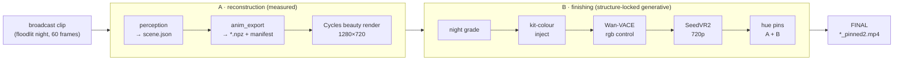
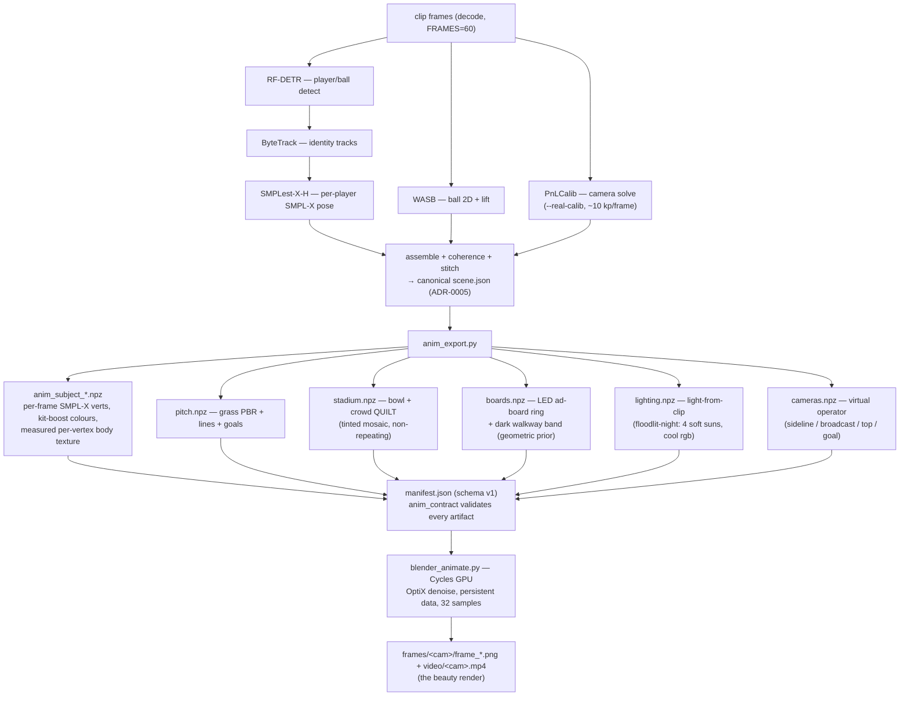
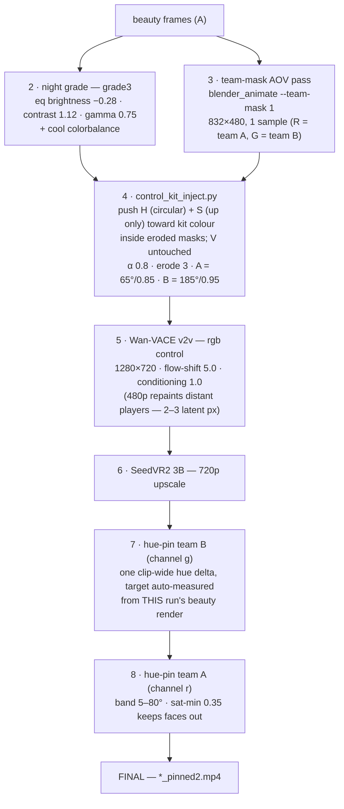

# The pipeline — broadcast clip → novel-view video

One command on the pod runs the whole thing (STATUS §0):

```bash
ANIM_CAMERAS=sideline OUT=out/anim_finish bash scripts/pod_finish_batch.sh
```

Two halves. **Reconstruction** measures the clip into a canonical 3D scene and renders it from
a new camera (the measured core — ADR-0005/0011). **Finishing** turns that render into a
photoreal broadcast frame with a structure-locked generative pass (reconstruct-then-condition,
STATUS §6). Everything below is per-camera; the finishing half eats exactly one camera's frames.



## A · Reconstruction — clip → scene → beauty render

`scripts/pod_make_video.sh` (wrapped as step 1 of the batch; `REUSE_SCENE=1` skips perception
when `scene.json` already exists).



Contract: the exporter and renderer only talk through `manifest.json`
(`src/pitch3d/adapters/blender/anim_contract.py`) — an unknown or key-incomplete artifact kills
the run at export time, not mid-render. New artifacts must be registered in `REQUIRED_KEYS`.

## B · Finishing — beauty render → photoreal night broadcast

Steps 2–8 of `scripts/pod_finish_batch.sh`. The control-signal insight (A/B 2026-07-03): the
generative pass copies **structure** from the control frames but re-invents anything it can't
read — so every step before v2v exists to make identity (kit colour, boards, night tone)
unambiguous in the control, and every step after undoes the drift v2v/upscale introduce.



Why each step survives (all eye-judged A/B on the target clip, log in STATUS §6):

| # | Step | Reason it exists | Kill switch |
|---|------|------------------|-------------|
| 2 | grade3 night grade | render is day-bright; the clip is floodlit night | edit `GRADE` in the script |
| 3 | team-mask AOV | one cheap pass feeds steps 4, 7, 8 | — |
| 4 | kit inject | grade3 erases kit colour in clusters → Wan hallucinates kits | `KIT_INJECT=0` |
| 5 | v2v rgb control | the photoreal pass; rgb beats depth/pose controls on this scene | `V2V_WIDTH/HEIGHT/FLOW`, `CS` |
| 6 | SeedVR2 | Wan output is soft; upscale restores broadcast crispness | — |
| 7 | pin B | v2v+upscale drift azure → blue-violet | `TARGET_HUE` override |
| 8 | pin A | same drift pulls yellow → orange | `PIN_A=0` |

## Where things live

| Piece | Path |
|-------|------|
| one-command batch | `scripts/pod_finish_batch.sh` |
| recon + export + render | `scripts/pod_make_video.sh` → `scripts/pod_real_e2e.sh`, `src/pitch3d/app/anim_export.py`, `scripts/blender_animate.py` |
| scene geometry (bowl, boards) | `src/pitch3d/core/scene/stadium.py` |
| kit inject / hue pin | `scripts/control_kit_inject.py`, `scripts/hue_pin.py` |
| v2v / upscale wrappers | `scripts/pod_v2v.sh`, `scripts/pod_seedvr2.sh` |
| export↔render contract | `src/pitch3d/adapters/blender/anim_contract.py` |
| durable run log + verdicts | `docs/STATUS.md` (§0 TL;DR, §6 A/B log) |

Every measured estimator ships a manual override (auto → CLI flag/env → validated default) —
the `TEAM_*_HSV`, `TARGET_HUE`, `--board-height 0` knobs above are instances of that rule.
